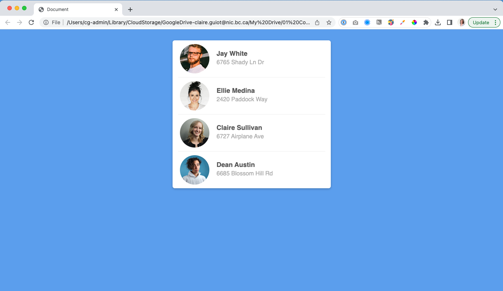

# extra-assignment

## Step 1: Instructions
1. Clone this repository onto your local computer.
2. In VS Code, create an NHTML file and an external stylesheet.
3. Recreate the page in the image below:


Tips: 
- Keep your HTML as stremlined as possible.
- You can use the following absolute URLS for the images:
  - https://images.unsplash.com/photo-1599566150163-29194dcaad36
  - https://images.unsplash.com/photo-1580489944761-15a19d654956
  - https://images.unsplash.com/photo-1628890923662-2cb23c2e0cfe
  - https://images.unsplash.com/photo-1628157588553-5eeea00af15c
- Use a list element to structure the content.
- Use flexbox to place items side-by-side.
- Add a drop shadow to the list.
- To create the ruler between the cards, use the following CSS style:
```css
    li:not(:last-child) {
        border-bottom: 1px solid #EEE;
    }
```

### Step 2: Validate your work
1. Go to https://validator.w3.org/#validate_by_upload to validate your HTML. Take a screenshot
2. Go to https://jigsaw.w3.org/css-validator/#validate_by_upload to validate your CSS. Take a screenshot.

### Step 3: Submit your work
Complete the following steps from the GitHub and GitHub Desktop Reference Guide:
1. Commit your changes if you’ve made changes since the last commit.
2. Push your changes to GitHub.
3. Submit your assignment in BrightSpace:
You can access the assignment submission tool by navigating to the week’s assignment in the Content Area, or by clicking on Assignments in the main menu. 
    * Click on the assignment submission link and follow the provided instructions. 
    * Don’t forget to answer the questions and attach the screenshots of your final W3 HTML and CSS validation results.
4. If you have been using a lab computer at the Comox Valley Campus to do your work with GitHub Desktop, remember to shutdown or restart the computer before you leave the room, so that other students won’t have access to your repositories.

## Deadlines
Assignments must be submitted before the end of the week but they will only be graded at the end of every unit. Late assignments will not be accepted and will receive an F. You can complete and submit a contract that allows you to extend the deadline for an assignment but you must email it to your instructor a minimum of 48 hrs before the deadline. Deadline extensions are only allowed for those unplanned, unexpected emergencies that life sometimes throws at us, and they will only be approved by your instructor if you follow the correct process. See the Course Info folder in BrightSpace for more info.